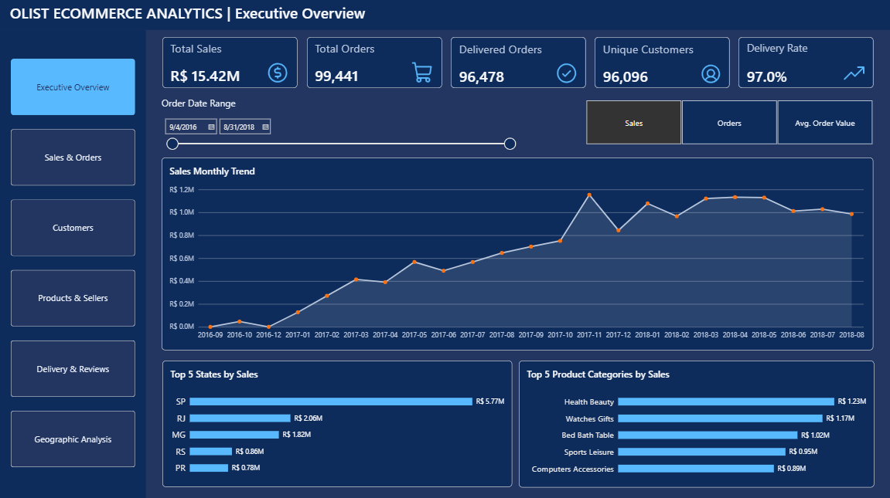
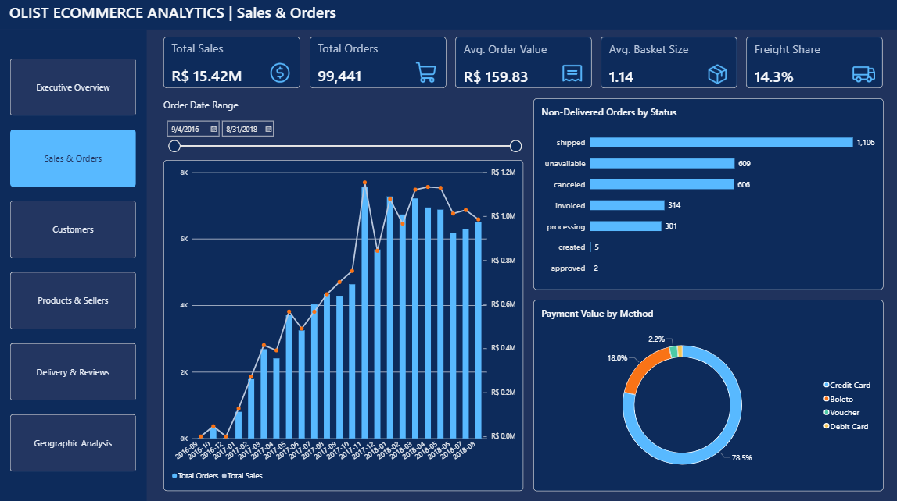
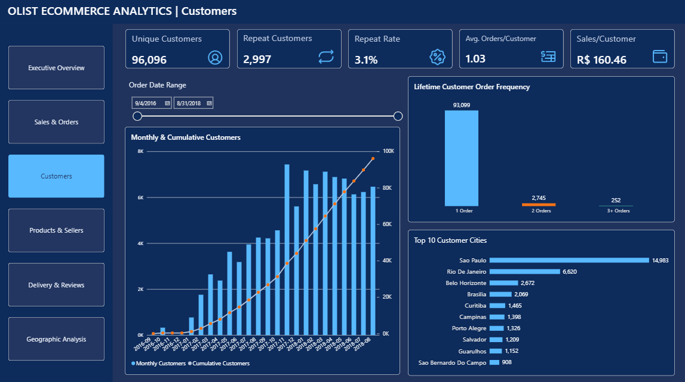
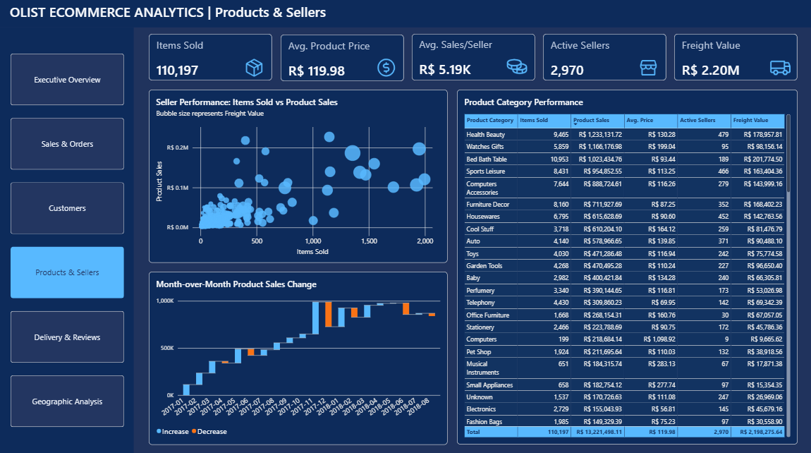
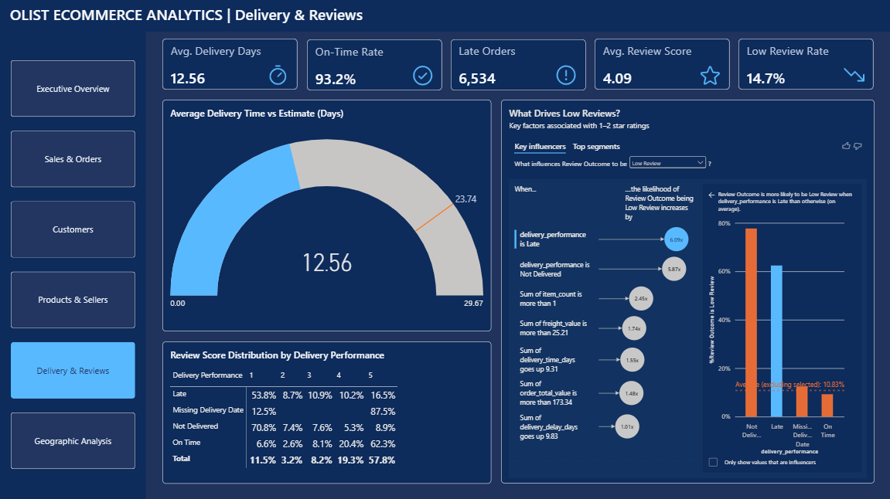
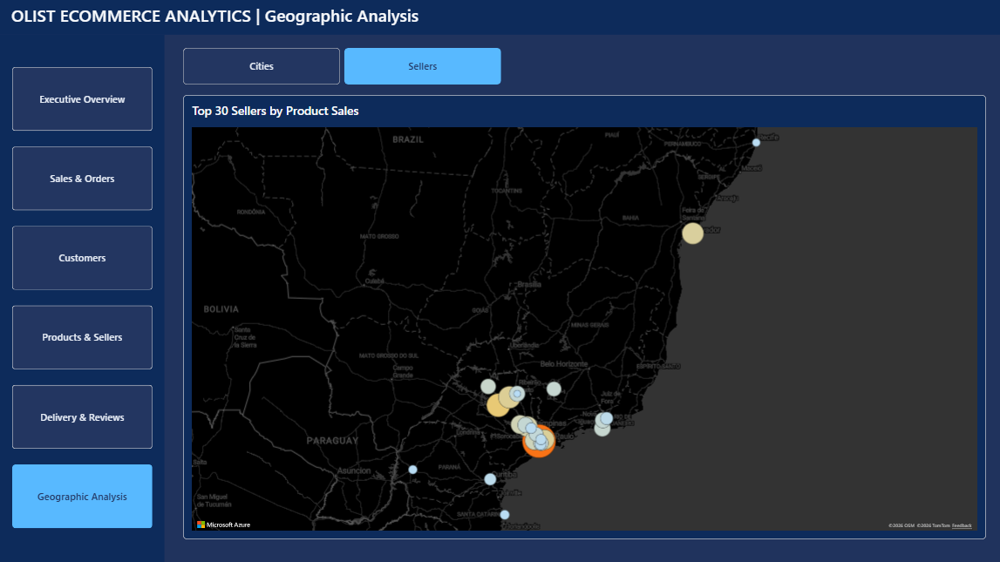

# Olist E-Commerce Analytics

An end-to-end e-commerce analytics project built with **Python, MySQL, and Power BI** using the Brazilian Olist dataset. The project transforms raw marketplace data into a structured analytical model and an interactive dashboard for monitoring sales, customers, products, sellers, delivery performance, and geographic trends.



## Project Overview

This project follows a complete analytics workflow:

1. Clean and validate the raw data with Python and Pandas.
2. Engineer analysis-ready features.
3. Build a relational analytical model in MySQL.
4. Answer business questions with SQL.
5. Create DAX measures and an interactive Power BI dashboard.

The analysis covers completed data through **August 2018**. Incomplete later months were excluded from monthly trend analysis.

## Business Questions

- How are sales and order volumes changing over time?
- Which states and product categories generate the most sales?
- How many customers make repeat purchases?
- Which sellers and categories perform best?
- What percentage of orders are delivered on time?
- Which delivery factors are associated with low review scores?
- Which cities and seller locations contribute the most sales?
- Which payment methods account for the highest payment value?

## Key Results

| Metric | Result |
|---|---:|
| Total Sales | R$ 15.42M |
| Total Orders | 99,441 |
| Delivered Orders | 96,478 |
| Unique Customers | 96,096 |
| Delivery Rate | 97.0% |
| Average Order Value | R$ 159.83 |
| On-Time Delivery Rate | 93.2% |
| Average Review Score | 4.09 |
| Repeat Customer Rate | 3.1% |

## Dashboard Pages

### 1. Executive Overview

High-level KPIs, monthly trends, leading customer states, and top product categories.


### 2. Sales & Orders

Monthly sales and order trends, non-delivered order statuses, basket size, freight share, and payment-method analysis.



### 3. Customers

Customer growth, cumulative customers, order frequency, repeat behavior, and leading customer cities.



### 4. Products & Sellers

Seller performance, category-level results, product sales changes, pricing, freight value, and active sellers.



### 5. Delivery & Reviews

Delivery speed, late orders, on-time performance, review-score distribution, and key factors associated with low reviews.



### 6. Geographic Analysis

Interactive Azure Maps views for the top customer cities and the locations of the top 30 sellers by product sales.




## Interactive Features

- Custom page navigation across six report pages
- Date slicer synchronized across the Executive Overview, Sales & Orders, and Customers pages
- All-time KPI cards that remain stable when the date slicer changes
- Metric switch for Sales, Orders, and Average Order Value
- Cross-filtering between related visuals
- Custom report-page tooltips for monthly performance
- Bookmark-based switch between Cities and Sellers maps
- Top-N filters for cities, states, categories, and sellers

## Data Model

The Power BI semantic model uses a star-schema-style design with these core tables:

- `fact_orders`
- `fact_order_items`
- `fact_payments`
- `dim_customers`
- `dim_products`
- `dim_sellers`
- `dim_dates`

Single-direction relationships were used to keep filter behavior predictable and avoid ambiguous paths.

## Tools and Technologies

| Tool | Purpose |
|---|---|
| Python / Pandas | Data cleaning, validation, and feature engineering |
| MySQL | Relational modeling and business analysis queries |
| Power BI | Semantic model, DAX measures, dashboard design, and interactions |
| DAX | KPIs, time-based metrics, rates, and dynamic visuals |
| Power Query | Data loading and type validation |
| Git / GitHub | Version control and project documentation |

## Repository Structure

```text
olist-ecommerce-analysis/
├── dashboard/
│   └── olist_ecommerce_dashboard.pbix
├── data/
├── images/
│   ├── dashboard/
│   └── icons/
├── notebooks/
├── sql/
│   ├── 01_schema_setup.sql
│   └── 02_business_analysis.sql
├── .gitignore
└── README.md
```

## Power BI Report

Download the Power BI report file:

[Download the PBIX report](dashboard/olist_ecommerce_dashboard.pbix)

> Power BI Desktop is required to open the `.pbix` file and use all interactions, bookmarks, and report-page tooltips.

## Data Source

The project uses the [Brazilian E-Commerce Public Dataset by Olist](https://www.kaggle.com/datasets/olistbr/brazilian-ecommerce), which contains anonymized marketplace data for orders, customers, sellers, products, payments, deliveries, geolocation, and reviews.

## Credits

- Dashboard icons: [Phosphor Icons](https://phosphoricons.com/)
- Icon files used in the report are stored in [`images/icons/`](images/icons/).

## Author

**Sara Ahmadi**  
Business Intelligence & Data Analytics Portfolio Project
